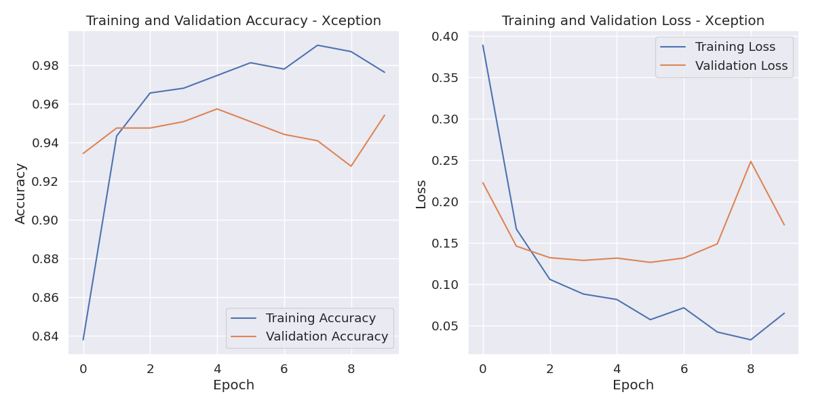
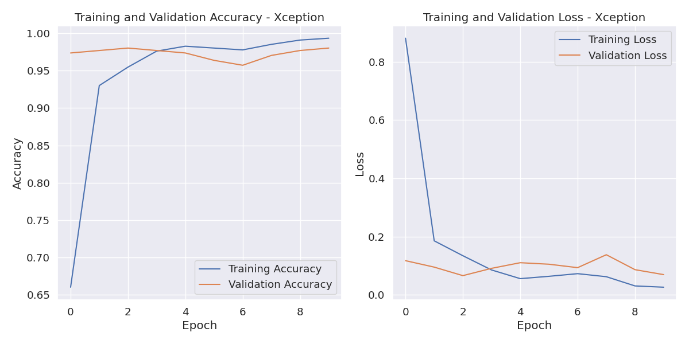
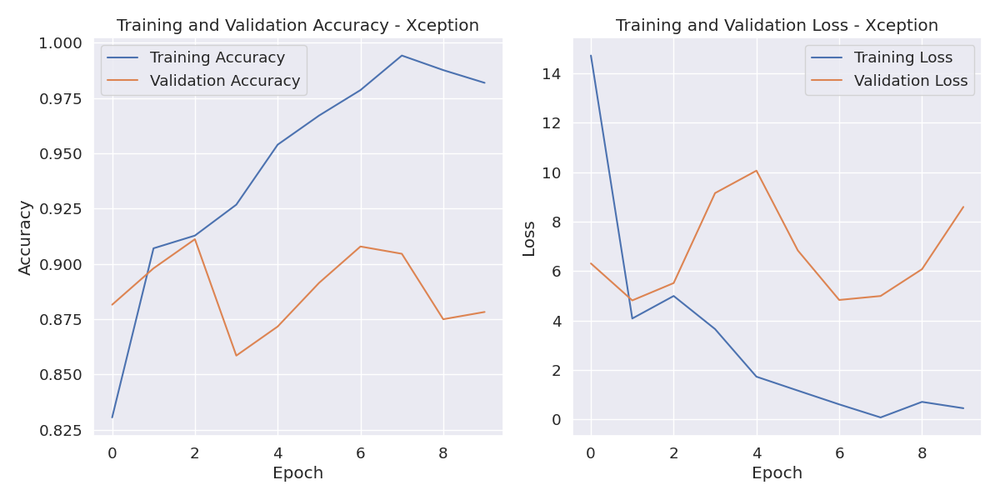
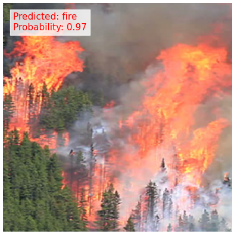
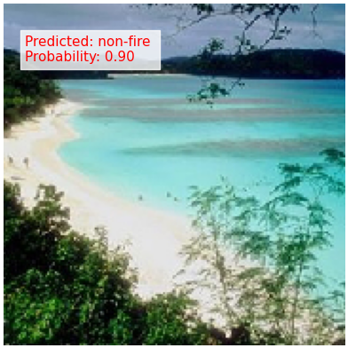

# Forest Fire Classification

### Introduction

In the Forest Fire Classification project, we aim to develop a robust model using TensorFlow framework that accurately identifies instances of forest fires from images. Leveraging pre-trained models like ResNet-50, Xception (transfer learning) alongside Convolutional Neural Networks (CNN) facilitates feature extraction and classification processes efficiently. The project involves collecting a diverse dataset of forest fire images along with non-fire images for training and evaluation purposes.  

Initially, we preprocess the dataset by resizing, normalizing, and augmenting images to enhance model generalization. We then split the dataset into training, validation, and testing sets to ensure unbiased evaluation. Employing transfer learning, we fine-tune ResNet-50 and Xception architectures on the dataset, adapting the pre-trained models' weights to classify forest fire images effectively.
 
During training, we employ techniques like learning rate scheduling, early stopping, and model checkpoints to optimize model performance and prevent overfitting. Additionally, we utilize techniques such as data augmentation to expand the dataset and improve model robustness. Extensive hyperparameter tuning and model optimization are performed to achieve the desired accuracy threshold of over 90%.  

Post-training, rigorous evaluation is conducted on the testing set to assess the model's performance in real-world scenarios. Metrics like accuracy, precision, recall, and F1 score are computed to gauge the model's effectiveness in detecting forest fires accurately. Finally, the model is deployed in production environments where it can actively monitor and identify forest fire occurrences, aiding in timely interventions and mitigating potential disasters.  

### Steps

* Installing Python, PyCharm, Git to Computer.
* Download the source dataset from [Kaggle](https://www.kaggle.com/datasets/alik05/forest-fire-dataset).
* For Classification algorithm decided to predict the features `Classes` from the dataset which is Binary classification `(fire, not fire)`.
* For Regression Problem algorithm decided to predict the feature `FWI` (Fire weather Index) which is 90%+ correlated to Classes Feature.

### Import Libraries: 

We import the necessary libraries specifically tailored for forest fire classification. These libraries enable efficient data manipulation for forest fire classification.

### Load Dataset :
We upload the dataset on our google drive and then access the forestfire dataset into our colab notebook code file, that allow us to work with the data, enabling data preprocessing, model development, and predictive analysis, all within a collaborative environment.
### Identify the Number of Classes :
After access the dataset from google drive , To identify the number of classes in Forest Fire Classification Dataset. This Dataset has two classes Fire and non Fire.

### Preprocessing and Feature Engineering :
After access the dataset from google drive, to identify the number of classes in forest fire classification. By using Tensorflow build in module , we split the dataset into training and validation by using 0.2 validation split , shuffle , image size and many other parameters etc. 
Training dataset is the dataset used to train the machine learning model. The model learns the underlying patterns and relationships in the data by adjusting its parameters. 
Validation dataset is a separate dataset used to evaluate the model's performance during training. This helps to prevent overfitting, which is when the model learns the training data too well and cannot generalize to new data.
### Visualization :

Show the atleast five images from each folder of forest fire classification like fire and non fire.

1 : RGB Images Display:
To display an RGB image, the computer first converts the Forest Fire Classification to a digital format. This is done by breaking down the image into a grid of pixels and assigning each pixel a value for each color channel. The computer then sends these values to the monitor, which uses them to control the intensity of the red, green, and blue subpixels for each pixel.
2 : RGB convert into GrayScale images:
To convert an RGB Forest Fire image to grayscale, the three color channels are combined into a single channel using a weighted average. The following weights are commonly used:

Grayscale = 0.2989 * Red + 0.5870 * Green + 0.1140 * Blue

These weights are chosen because they mimic the human eye's sensitivity to different colors. The human eye is most sensitive to green light, followed by red light, and then blue light. 
  

2 : Grayscale images convert into Normalization:

Image normalization is the process of transforming an image so that its pixel values have a mean of zero and a standard deviation of one. This is often done before training a machine learning model on images, as it can help the model to learn more effectively.

To normalize a grayscale image, the following steps are typically taken:

Subtract the mean of the image from each pixel.
Divide each pixel by the standard deviation of the image.

This will result in an image with pixel values that are centered around zero and have a standard deviation of one.  
  

### Model Buiding:
### CNN model with Tensorflow:
The TensorFlow CNN model described above is a simple but effective model for image classification. It consists of the following layers:
* Rescaling layer (1./255, input_shape=(img_height, img_width, 3)): Scales the input images down to a range of [0, 1].
* Conv2D layer (16 filters, 3x3 kernel size, same padding, ReLU activation function): Extracts low-level features from the image, such as edges and corners.
* MaxPooling2D layer: Reduces the dimensionality of the feature maps by reducing the size of each feature map by half.
* Conv2D layer (32 filters, 3x3 kernel size, same padding, ReLU activation function): Extracts higher-level features from the image, such as shapes and textures.
* MaxPooling2D layer: Reduces the dimensionality of the feature maps by reducing the size of each feature map by half.
* Conv2D layer (64 filters, 3x3 kernel size, same padding, ReLU activation function): Extracts even higher-level features from the image, such as objects and scenes.
* MaxPooling2D layer: Reduces the dimensionality of the feature maps by reducing the size of each feature map by half.
* Flatten layer: Converts the feature maps into a 1D vector.
* Dense layer (128 units, ReLU activation function): Learns higher-level features from the flattened feature maps.
* Dense layer (num_classes): Outputs the probability distribution over the num_classes output classes.
To train your model, you would simply need to compile it using an optimizer and loss function of your choice. Then, you could train it on your training data using the model.fit() method. Once the model is trained, you could evaluate it on your test data using the model.evaluate() method.  

### Xception: 
The model is used for binary image classification, meaning that it will output the probability that an image belongs to one of two classes.
The code works as follows:
* The IMG_SIZE variable is defined to specify the height and width of the input images.
* The base_model variable is created by loading the pre-trained Xception model, but removing the top output layer. This helps to use the model as a feature extractor for a specific binary classification problem.
* The model_xception variable is created by adding the platform model to the Sequential model, then adding the Flatten, Dense, and Dropout classes to create a composite model.
* The weights of the base model (base_model) are set to non-trainable (trainable=False), meaning these weights will not be updated during training.
* The model is compiled using the binary_crossentropy loss function, Adam optimizer, and metric accuracy to monitor model performance during training and evaluation.
* If your dataset is significantly different from the dataset the Xception model was pre-trained on, you may consider fine-tuning the model on your dataset. To do this, you need to set the base_model's trainable property to True and train the model as usual. This allows the model to learn new weights that are appropriate for your dataset.  

### Resnet Network:  
The model is built using the following steps:
* The resnet_50 variable is created by loading the ResNet50 pre-trained model.
* The x variable is assigned to the output of the resnet_50 model.
* A GlobalAveragePooling2D layer is added to the model. This layer averages the values of each feature map over the spatial dimensions.
* A Dense layer with 512 units and a ReLU activation function is added to the model. This layer learns higher-level features from the global average pooled features.
* A Dropout layer with a rate of 0.5 is added to the model. This layer randomly drops out neurons during training to prevent overfitting.
* A Dense layer with 256 units and a ReLU activation function is added to the model. This layer learns even higher-level features from the dropout layer.
* A Dropout layer with a rate of 0.5 is added to the model. This layer randomly drops out neurons during training to prevent overfitting.
* A Dense layer with num_classes units and a softmax activation function is added to the model. This layer outputs the probability distribution over the num_classes output classes.
* The model is created by passing the inputs and outputs to the Model class.
* This model is likely to achieve good performance on a variety of image classification tasks. However, it is important to note that the ResNet50 pre-trained weights were trained on a dataset that contains a wide variety of images. If your dataset is very different from the dataset that the ResNet50 model was trained on, then you may want to consider fine-tuning the model on your own dataset.
* To fine-tune the model, you would simply need to set the trainable attribute of the resnet_50 model to True and train the model as usual. This will allow the model to learn new weights that are specific to your dataset.

### Result training:
 
  
  
  
### Output samples:
 
  
  

### **Technologies used**

### **Tools used**

<!-- Tools Used -->
[PyCharm]: https://code.visualstudio.com/
[git]: https://git-scm.com/
[github]: https://github.com/
[python]: https://www.python.org/
[sklearn]: https://scikit-learn.org/stable/

### Authors

Pham Duc Long
